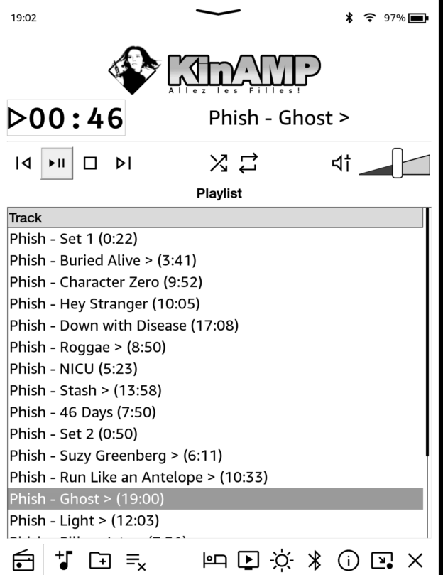
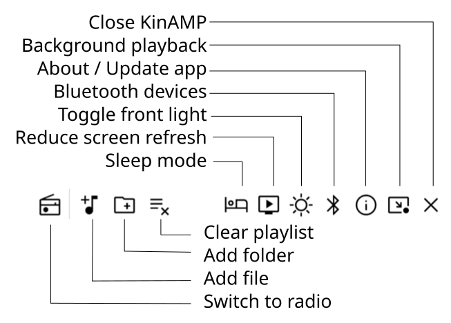
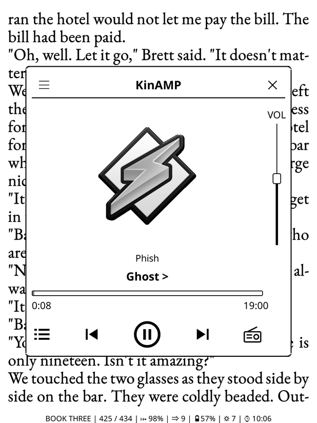

KinAMP3 - It really whips the llama's ass!
==========================================

Kinamp is a native music and internet radio player developed for jailbroken Kindles.

**Contents**
Features - Using as native app - Koreader plugin - Installation

Features
--------

- Fully native fast (C++ and GTK2) interface
- Simple to use
- Internet radio streams
- Koreader plugin
- Interface optimized for eink displays (minimal redraws to save battery)
- Low power consumption (4-5% per hour with frontlight and display updates off)
- Fast access to Bluetooth and frontlight settings
- Background mode to continue listening while reading.
- Uses [miniaudio](https://github.com/mackron/miniaudio) library for decoding.
- Uses the integrated GStreamer library for output
- No other dependencies

**Supported audio formats:**
- MP3
- FLAC
- WAV
- OGG (Vorbis)
- AAC

**IMPORTANT NOTE** This is the *Beta* version of KinAMP3, an important update of this application. **It might contain bugs. Please report any bugs, ideas, suggestions** by filing an issue.

Usage
------

### Native app

Start the native app using the **KinAMP** booklet from the library. You can also use **KUAL** launcher to start the app.

The usage is quite straitforward: Previous, Play/pause, Stop and Next buttons, Repeat and Shuffle and Volume slider. *Note: as there's a buffering between the decoder and the playback, the volume change will take around 1 second*.

The player has 2 modes: *music mode* - will play local audio files and *radio mode* - playing internet radio stations. Switch between the two modes with the button in the lower left corner.

#### Using radio mode

First, you need to create your favorite radio list. Start the **Radio list editor** utility from KUAL. Add a station from the provided list (*over 45000 radio stations!*) or add the station URL manually.

Then, switch to radio mode using the button in lower left corner. The playlist will be replaced with the radio station list.

##### Creating a station list manually

Create a file called `.kinamp_radio.txt` using a text editor with the list of your preferred stations in the format `Station name|URL` for each line. Example:

    Virgin Radio|http://icy.unitedradio.it/VirginHardRock.mp3

Copy this file to the Kinamp folder on the Kindle.

#### Using background mode

- Start KinAMP and create your desired playlist.
- Click the *Background* button (rectangle with an arrow, next to close). KinAMP will close and background playback will start
- To stop background playback, click the KinAMP booklet again.

### Koreader plugin

The KinAMP plugin is in the Koreader *Tools menu*. It will display a floating player as in the screenshot below:

Use the left button to access the playlist editor, the right button for the radio stations. Unlike the native app, the **Koreader plugin allows to manage directly the radio stations**. The plugin also allows saving and loading playlists directly.

The *hamburger menu* (top left corner) contains the more advanced options: playback order, bluetooth connection management, about dialog. To completely shut down the player daemon, choose *Quit player*.

#### Quick access to KinAMP in Koreader

To quickly access KinAMP, set a gesture to invoke it: Cog menu > Taps and Gestures > Gesture Manager > Tap corner. Set bottom right to KinAMP: show player. This will allow to access KinAMP with a tap at the bottom right corner.

**This is recommended if you plan to listen music more often while reading.**

Installation
------------

Download the latest release and unzip it to the root of the Kindle. Start it from KUAL or from the home screen.

For more information about building and porting for other devices, consult the [Hacking](HACKING.md) document.

License
-------

This program is free software: you can redistribute it and/or modify it under the terms of the **GNU General Public License** as published by the Free Software Foundation, either version 3 of the License, or (at your option) any later version. This program is distributed in the hope that it will be useful, but WITHOUT ANY WARRANTY; without even the implied warranty of MERCHANTABILITY or FITNESS FOR A PARTICULAR PURPOSE. See the GNU General Public License for more details. You should have received a copy of the GNU General Public License along with this program. If not, see <http://www.gnu.org/licenses/>.
